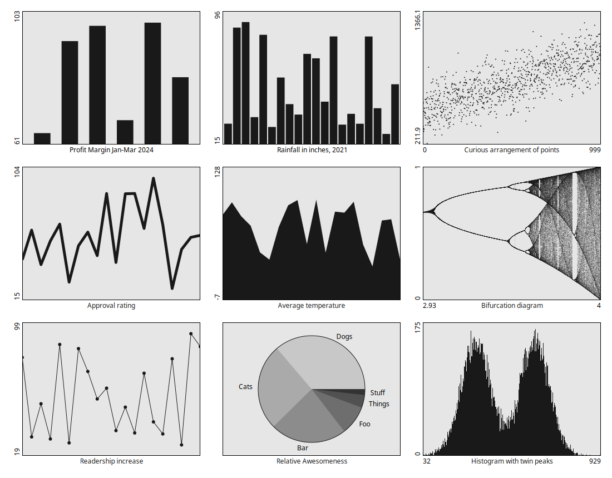

# blchart

A very minimal charting library for [blcairo](https://github.com/bit101/blcairo) and [bitlib](https://github.com/bit101/bitlib).

## Charts
- Bar chart
- Line chart
- Pie chart

## Features:
- Position and size chart
- Default grayscale theme
- Customizable colors:
    - Foreground
    - Background
    - Border
    - Category colors for pie chart
- Chart label
- Show/hide labels
- Label font size
- Value label rotation
- Value label precision
- Pie chart values or labels
- Bar chart spacing
- Line chart line width
- Line chart show points
- Line chart point radius
- Line chart fill area
- Manual chart scale
- Auto scale
- Auto scale compression (top/bottom spacing)

## Examples

